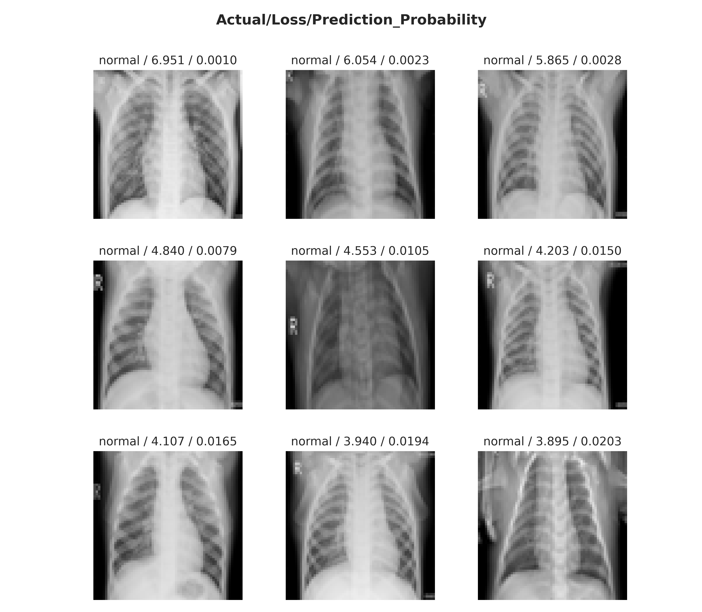

<h1> Pneumonia detection in chest X-ray images using CNNs and Transfer learning </h1>

The purpose of this project is to examine a convolutional neural network model on the image classification problem of pneumonia detection in chest X-ray images. For this reason, the deep learning model VGG-19 is trained and tested on the Chest X-ray Images dataset. Furthermore, transfer learning is applied to speed up the training and further improve the performance.

The problem includes detecting whether or not pneumonia shows up on input X-ray images, i.e. binary classification problem, with the goal of providing an additional help in the medical diagnosis procedures. To implement the solution, multiple different technologies and tools are used, mainly including Python and Keras.

In summary, the following can provide a simple introduction to image classification and transfer learning with the Keras machine learning library.

## Methods and Algorithms Used
* Image Data Preprocessing
* Machine Learning
* Transfer Learning
* Image Classification
* Convolutional Neural Networks
* Precision, Recall, F1-Score
* etc.

## Technologies
* Python
* Keras
* Scikit-learn 
* NumPy, Pandas 
* Matplotlib, Seaborn
* Jupyter Notebook
* etc. 

## Dataset
* Chest X-Ray Images
  
Analysis of the results is given in the [Results and Discussion](#results-and-discussion) section. In short, the pre-trained VGG-19 model gives the accuracy of **89%** and the loss of **0.273** on the validation set of the Chest X-Ray Images dataset. Training and validation sets are pre-defined and transfer learning is applied on the VGG-19 model with the Keras library. Additional metrics like Precision, Recall and F1-Score are computed in the section as well, with the complementary visualization of the results. 

<h1> Table Of Contents </h1>

- [Project Description](#project-description)
- [Chest X-Ray Images](#chest-x-ray-images)
- [Transfer Learning](#transfer-learning)
- [VGG-19 Model](#vgg-19-model)
- [In a Nutshell](#in-a-nutshell)
  - [1. Download and extract the dataset file](#1-download-and-extract-the-dataset-file)
  - [2. Data preparation](#2-data-preparation)
  - [3. Visualize the dataset](#3-visualize-the-dataset)
  - [4. CNN model - VGG19](#4-cnn-model---vgg19)
  - [5. Train the model](#5-train-the-model)
  - [6. Results](#6-results)
- [Results and Discussion](#results-and-discussion)
- [References](#references)

# Project Description

This project includes implementation of deep learning and computer vision techniques for detection of pneumonia in X-ray images from the Chest X-ray Images dataset. The CNN model classifies whether or not pneumonia shows up on the chest X-ray images, therefore only two predictions are possible, normal or pneumonia.

In the data preprocessing step, samples from the dataset are resized to a shape (64,64), normalized and converted to the RGB color space. To reduce the classification bias caused by data imbalance, class weights are applied.

The classifier used is the VGG-19 model with weights pre-trained on the ImageNet dataset. This network is supported in the Keras library, along with a transfer learning workflow performed in the project. The workflow consists of two phases, the first includes optimizing the output (classification) layer only, while the second includes retraining (fine-tuning) the entire network with much smaller learning rate. The training is performed in 25 epochs in the first phase and one final fine-tuning epoch in the second.

Evaluation of the model is performed with accuracy, precision, recall and f1-score metrics on the validation set. Confusion matrices and other appropriate plots are used to further describe obtained results as well.

# Chest X-Ray Images
The dataset used in the project is available on [Kaggle](https://www.kaggle.com/paultimothymooney/chest-xray-pneumonia) and [Mendeley](https://data.mendeley.com/datasets/rscbjbr9sj/2) and it contains  5856 labeled pediatric chest X-ray images, distributed in **two classes**: 
1. normal
2. pneumonia 

The training and validation sets are pre-defined and contain 5216 and 624 images respectively. As can be seen in **Figure 1.**, the distribution of samples is imbalanced, with the majority of cases being pneumonia. To have the imbalance is expected when it comes to medical data and quite common in practice as well.

<figure>
  <p align="center">
     <br>
    <b>Figure 1.</b> Class distribution of training and validation sets.
  </p>
</figure>

However, to lessen the effects of classification bias in the imbalanced data, class weights are used. The weights can be calculated with the following expression: 

<p align="center">
  
</p>


<p align="center">
  
</p>

, where *w<sub>j</sub>* is the weight for each class *j*. After adding the weights to the cost function, the cost penalty is proportionally increased for the under-represented class samples. In turn, the model has to give more attention to those samples, and as a result the bias of the model should shift towards the middle, leading to the model that generalizes better overall.

Images in the dataset are greyscale with different dimensions, therefore resizing and converting images to the RGB color space is required in the preprocessing phase. The dataset has **three types of images**:
1. normal (no abnormalities detected - n.a.d.)
2. bacterial pneumonia
3. virus pneumonia 
   
, and their distribution for each set is given in **Figure 2**.

<figure>
  <p align="center">
     <br>
    <b>Figure 2.</b> Distribution of different image types in the datasets.
  </p>
</figure>

<figure>
  <p align="center">
     <br>
    <b>Figure 3.</b> Three types of images in the datasets.
  </p>
</figure>

The  chest  x-ray images  depicted  in **Figure 3.** and **Figure 4.**  are  of  patients  in  the  age  group  of  one  to  five  from  Guangzhou  Women  and Children’s Medical Centre, Guangzhou. All chest X-ray imaging was performed as part of patients’ routine clinical care [2]. 

<figure>
  <p align="center">
     <br>
    <b>Figure 4.</b> Labeled chest X-ray images in the dataset.
  </p>
</figure>

# Transfer Learning

Transfer learning is a machine learning method where a model developed for a task is reused as the starting point for a model on a second task [3]. In other words, model optimization starts from some initial pre-trained state, with parameter values learned on some other dataset. Therefore, this method is very important in deep learning where models excel at learning from a large number of labeled examples, which aren't always available.

Transfer learning is usually done for tasks where a dataset has too little data to train a full-scale model from scratch [8]. 

The learning process of neural networks includes gradually building up abstractions over the course of multiple layers. At first, edges are detected, then those edges are used to detect textures, the textures to detect patterns, the patterns to detect parts of objects and so on, as depicted in **Figure 5.** [4].

<figure>
  <p align="center">
     <br>
    <b>Figure 5.</b> Feature visualisation in neural networks [4].
  </p>
</figure>


The transfer learning workflow applied in this project, and generally the most common approach in the context of deep learning is [8]: 

1. Take layers from a previously trained model.
2. Freeze them, so as to avoid destroying any of the information they contain during future training rounds.
3. Add some new, trainable layers on top of the frozen layers. They will learn to turn the old features into predictions on a new dataset.
4. Train the new layers on your dataset.

<figure>
  <p align="center">
     <br>
    <b>Figure 6.</b> The transfer learning approach applied in this project [5].
  </p>
</figure>

# VGG-19 Model
VGG-19 is a convolutional neural network that is 19 layers deep. In particular, 16 convolution layers and three fully connected layers, as well as five maxpool layers and one softmax output layer. A pre-trained version of the network is trained on more than a million images from the ImageNet database. The pre-trained network can classify images into 1000 object categories, such as keyboard, mouse, pencil, and many animals. As a result, the network has learned rich feature representations for a wide range of images [7]. 

 The general architecture of the model can be seen in **Figure 7**., along with additional information like kernels sizes, depth and else.

<figure>
  <p align="center">
     <br>
    <b>Figure 7.</b> Illustration of the network architecture of VGG-19 model [1].
  </p>
</figure>

# In a Nutshell   

The code is placed in the  [`xray_pneumonia_detection.ipynb`](notebooks/../xray_pneumonia_detection.ipynb) Jupyter Notebook file. 

The notebook consists of six sections:
1. Download and extract the dataset file
2. Data preparation
3. Visualize the dataset
4. CNN model - VGG19
5. Train the model
6. Results


## 1. Download and extract the dataset file
* The dataset is available both on [Kaggle](https://www.kaggle.com/paultimothymooney/chest-xray-pneumonia) and [Mendeley](https://data.mendeley.com/datasets/rscbjbr9sj/2).

## 2. Data preparation
* The data preparation section includes building a Pandas DataFrame object from a directory where the dataset is stored. 
* The relatively small size of the dataset makes it possible to preload the entire data into memory. In this case, the benefit of fast access to the data during training is much bigger then the expense of increased memory usage.

## 3. Visualize the dataset

* This notebook section consists mostly of code for extracting information about various distributions in the dataset and creating their corresponding graphs in addition to other plots shown in the [Chest X-Ray Images](#chest-x-ray-images) section.
* Data visualization provides a more detailed introduction to the dataset and an additional look at the structure of the data. From this visualization, the data imbalance becomes apparent and therefore can be corrected with class weights later.

## 4. CNN model - VGG19
* The following code block contains definition of the model employed in this project. 
* The implemented transfer learning workflow is from [this](https://keras.io/guides/transfer_learning/) Keras tutorial, but in this case, the base model is the VGG-19 model with weights pre-trained on the ImageNet dataset. On top of the base model, as the output layer of the classifier, a single unit dense layer is added, along with the sigmoid activation function.
* It is important to note that weights of the base model are set frozen, which means that their values aren't modified during the training phase, i.e. pre-trained knowledge collected on the ImageNet dataset will stay preserved. On the other hand, weights of the output layer are trainable and can be modified in training.

```python
# input image size
IMAGE_SIZE = (64, 64, 3)

# instantiate a base model with pre-trained weights
vgg19 = VGG19(weights='imagenet',         # load weights pre-trained on ImageNet
              include_top=False,          # do not include the ImageNet classifier at the top
              input_shape=IMAGE_SIZE)  

# freeze the base model
vgg19.trainable = False

# create a new model on top
inputs = keras.Input(shape=IMAGE_SIZE)
x = vgg19(inputs, training=False)
x = keras.layers.GlobalAveragePooling2D()(x)
outputs = keras.layers.Dense(1, activation='sigmoid')(x)
model = keras.Model(inputs, outputs)  
```

## 5. Train the model
* In the following code block, computing of the class weights is demonstrated. A count of `pos` (pneumonia) and `neg` (normal) cases is calculated with a help of a Pandas DataFrame object and the equation from [this](https://www.tensorflow.org/tutorials/structured_data/imbalanced_data#calculate_class_weights) TensorFlow tutorial. 

```python
pos, neg = train_cxr_df['label'].value_counts().to_numpy()

weight_for_0 = (1 / neg)*(pos+neg)/2.0 
weight_for_1 = (1 / pos)*(pos+neg)/2.0

class_weight = {0: weight_for_0, 1: weight_for_1}
```
* The second block shows how images in the dataset are preprocessed and how to generate batches with Keras, in this case without any data augmentation techniques.
```python
BATCH_SIZE = 32

datagen = ImageDataGenerator(rescale=1.0/255.0)

train_it = datagen.flow(X_train, 
                        y=y_train, 
                        batch_size=BATCH_SIZE, 
                        shuffle=True)

val_it = datagen.flow(X_test, 
                      y=y_test, 
                      batch_size=BATCH_SIZE, 
                      shuffle=False)
```
* The last code block of this section shows the transfer learning workflow implemented in this project. 
* The workflow is comprised of two phases in which the model is trained. The first phase includes training only the output layer weights, whereas the second refers to the training of the entire network (after the weights of the base model are unfrozen). The learning rate in the second phase is decreased by an order of magnitude to reduce the possibility of overfitting and to achieve desired effects of fine-tuning. In addition, the second phase has only one epoch, while the first one has 25 epochs. 
  
```python
EPOCHS = 25
EPOCHS_FT = 1

# configure the model for training (Adam, Binary Cross-Entropy, Accuracy)
model.compile(optimizer=keras.optimizers.Adam(learning_rate=1e-4),
              loss=keras.losses.BinaryCrossentropy(),
              metrics=[keras.metrics.BinaryAccuracy()])

# train only the trainable layers
history1 = model.fit(train_it, epochs=EPOCHS, batch_size=BATCH_SIZE, validation_data=val_it, class_weight=class_weight)

# unfreeze the base model
vgg19.trainable = True

# recompile the model after changing the value of learning rate
model.compile(optimizer=keras.optimizers.Adam(1e-5),  
              loss=keras.losses.BinaryCrossentropy(),
              metrics=[keras.metrics.BinaryAccuracy()])

# train end-to-end
history2 = model.fit(train_it, epochs=EPOCHS_FT, batch_size=BATCH_SIZE, validation_data=val_it, class_weight=class_weight)
```

## 6. Results
* In this section various metrics are measured in order to evaluate the model performance. 
* This includes calculating accuracy and loss on both training and validation sets and plotting their corresponding graphs. Additional metrics like precision, recall and f1-score are measured as well, with a help of the Sckit-learn's function [`sklearn.metrics.classification_report`](https://scikit-learn.org/stable/modules/generated/sklearn.metrics.classification_report.html). 
* To further visualize the model performance, a confusion matrix is computed with the Sckit-learn's function [`sklearn.metrics.confusion_matrix`](https://scikit-learn.org/stable/modules/generated/sklearn.metrics.confusion_matrix.html) and plotted with the Seaborn's function [`seaborn.heatmap`](https://seaborn.pydata.org/generated/seaborn.heatmap.html). 
* Finally, a plot of nine X-ray images with the top losses is given, to provide another insight into which samples are most difficult to classify. The following block shows code for this function. Also, the function uses the custom `show_batch` function for plotting a sample batch from the dataset.
  
``` python
def plot_top_losses(k, X, y_true, predict, loss, labels, **kwargs):
    """Plots samples with the top losses from the given dataset."""
    y_pred = predict(x=X, batch_size=BATCH_SIZE)
    loss_values = np.array(loss(y_true, y_pred))
    top_k = loss_values.argsort()[-k:][::-1]

    worst_batch = []
    for idx in top_k:
        true_prob = y_test[idx]*y_pred[idx] + (1-y_test[idx])*(1-y_pred[idx])
        classID = int(y_true[idx])
        title = '%s / %.3f / %.4f' % (labels[classID], loss_values[idx], true_prob)
        worst_batch.append((X[idx], title))

    show_batch(worst_batch, title='Actual/Loss/Prediction_Probability', **kwargs)
```
* Motivation for this function was derived from the function `plot_top_losses` implemented in the fastai library.

# Results and Discussion
Model evaluation is performed on the validation set, after completing both training phases. To get a more in-depth overview of the model performance, various metric are computed, alongside complementary graphs and plots.

The metrics selected for the purposes of this project are [6]:
* **Accuracy** - the percentage of examples correctly classified
  <p style="margin-left: 40px">
    
  </p>
* **Precision** - the percentage of predicted positives that were correctly classified
  <p style="margin-left: 40px">
    
  </p>
* **Recall** - the percentage of actual positives that were correctly classified
  <p style="margin-left: 40px">
    
  </p>
* **F1-Score** - the harmonic mean of the precision and recall
  <p style="margin-left: 40px">
    
  </p>
, where **false negatives** (FN) and **false positives** (FP) are samples that were incorrectly classified, whereas **true negatives** (TN) and **true positives** (TP) are samples that were correctly classified.

Since the classes are not balanced, using accuracy as the only metric is not adequate and can even give a completely false sense of the model performance. For example, a dummy classifier that incorrectly classifies everything as positive (pneumonia), would achieve the accuracy of 62.5 % on the validation set (since there is 390 pneumonia cases of 624 cases in total), and that's why it is extremely important to compute other metrics like precision and recall for each class. 

However, there is a certain trade-off between precision and recall, particularly between false positives and false negatives, in the denominator. In other words, the trade-off occurs due to increasing one of the precision or recall, while keeping the model same. This is possible, for instance, by changing the threshold of the classifier. An intuitive example would be changing the classification threshold in a logistic regression model (sigmoid activation function) . By lowering the threshold, more samples are classified as positives, meaning ultimately there will be less false negatives and the recall will be higher. Consequently, more borderline samples are wrongly classified as positives, i.e. the number of false positives increases, and as a result the precision drops. In summary, by increasing the threshold, a model becomes more rigid and precision increases. However, there is more false negatives as well, and therefore recall decreases accordingly.

Finally, f1-score describes the relationship between precision and recall. A good f1-score means that there is a low number of false positives and false negatives, hence true positives are confidently identified, with a very low number of "false alarms". The higher the f1-score the better, with 0 being the worst possible and 1 being the best.

The another metric used in the model evaluation is loss, in particular, the binary cross-entropy loss function. Also, loss can be computed in conjunction with accuracy in the training phase, as depicted in **Figure 8.**

<figure>
  <p align="center">
     <br>
    <b>Figure 8.</b> Accuracy and loss graphs for training and validation sets.
  </p>
</figure>

As can be seen in **Figure 8.**, accuracy and loss values are changing quite similarly on both sets. However, the model gives slightly better results on the training set, which is a clear indication of overfitting. This becomes particularly visible in the loss graph, especially when considering the extremely small loss score on the training set after the fine-tuning phase in the last epoch. Nonetheless, the model achieves the accuracy of **89 %** and the loss of **0.273** on the validation set.

<figure>
  <p align="center">
     <br>
    <b>Figure 9.</b> Normalized confusion matrix and confusion matrix without normalization.
  </p>
</figure>

The confusion matrices in **Figure 9.** show that the model has the high recall of **96 %**, however in the same time, the precision of **88 %** is somewhat worse. This results show that the model detects pneumonia in X-ray images 96 % of the time when there is an actual case of pneumonia on the image. Still, even though it is a small percentage, the other 4 % accounts for 15 patients that were wrongly classified as healthy on the validation set. Therefore, a serious matter of this classification problem demands making a special effort in the fine-tuning of the model, because when it comes to the medical diagnosis every additional percentage is very important. 

In the same time, the lower precision percentage indicates a certain bias towards positives, meaning that a considerable number of the normal cases will be wrongly classified as pneumonia. In the end, the discussed precision-recall trade-off, considering this problem in particular, should be acceptable, since in practice it is much preferable for the model to wrongly classify a healthy patient, then to miss on a positive one, potentially causing a dangerous mistake.


<figure>
  <p align="center">
     <br>
    <b>Figure 10.</b> Classification report.
  </p>
</figure>

In addition, **Figure 10.** shows the other metrics computed on the validation set. In particular, precision and recall for the normal class, as well as f1-score for both classes. Once again, it can be seen that the recall of normal samples is much worse in comparison to the pneumonia one. Consequently, a lot of normal samples will be classified as positives, which definitely undermines the quality of the model. 

And finally, **Figure 11.** shows which are the most inaccurately classified samples in the validation set. Moreover, the model has wrongly classified these samples with very high confidence and each time it was the case of classifying a normal image as pneumonia. This observation also aligns with the previous, confirming the model's bias towards the positives. On the other hand, some of the images are arguably quite visually similar to some images with pneumonia (see **Figure 4.**), with an obvious lack of quality in some of them as well (e.g. the far left in the first row).

<figure>
  <p align="center">
     <br>
    <b>Figure 11.</b> Nine X-ray images with the top losses from the validation set.
  </p>
</figure>

<br>

# References

1. Zheng, Yufeng & Yang, Clifford & Merkulov, Aleksey. (2018). *Breast cancer screening using convolutional neural network and follow-up digital mammography*. 4. 10.1117/12.2304564. Available: https://www.researchgate.net/publication/325137356_Breast_cancer_screening_using_convolutional_neural_network_and_follow-up_digital_mammography
2. Jain, Rachna & Nagrath, Preeti & Kataria, Gaurav & Kaushik, V. & D, Jude. (2020). *Pneumonia Detection in chest X-ray images using Convolutional Neural Networks and Transfer Learning*. Measurement. 165. 108046. 10.1016/j.measurement.2020.108046. Available: https://www.researchgate.net/publication/342619947_Pneumonia_Detection_in_chest_X-ray_images_using_Convolutional_Neural_Networks_and_Transfer_Learning
3. Jason Brownlee 2017, *Deep Learning for Computer Vision: A Gentle Introduction to Transfer Learning for Deep Learning*, Machine Learning Mastery, viewed December 2020. Available: https://machinelearningmastery.com/transfer-learning-for-deep-learning/
4. Christopher Olah, Research Scientist et al. 2017, *Feature Visualization*, Google AI Blog, viewed December 2020. Available: https://ai.googleblog.com/2017/11/feature-visualization.html
5. Unit8 2019, *Detecting pneumonia on X-ray images - ConvNets and Transfer Learning*, Medium, viewed December 2020. Available: https://medium.com/unit8-machine-learning-publication/detecting-pneumonia-on-x-ray-images-covnets-and-transfer-learning-6d94b58c6657
6. TensorFlow 2020, *Tutorials: Classification on imbalanced data*, TensorFlow, viewed December 2020. Available: https://www.tensorflow.org/tutorials/structured_data/imbalanced_data#class_weights
7. MathWorks 2020, *VGG-19 convolutional neural network*, MathWorks, viewed December 2020. Available: https://www.mathworks.com/help/deeplearning/ref/vgg19.html
8. François Chollet 2020, *Developer guides: Transfer learning & fine-tuning*, Keras, viewed December 2020. Available: https://keras.io/guides/transfer_learning/