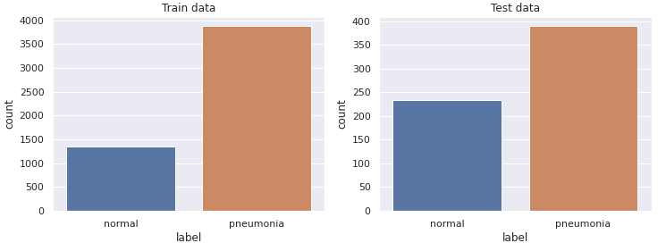
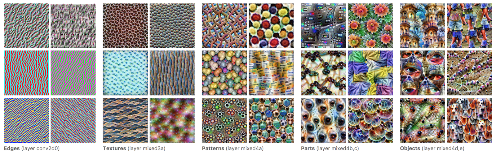

<h1> Pneumonia Detection in Chest X-ray Images using CNNs and Transfer Learning </h1>

The main idea of the project was to build a CNN model for the image classification problem of pneumonia detection in chest X-ray images. For this purpose, the VGG-19 deep learning model was trained and tested on the [Chest X-ray Images](https://www.kaggle.com/paultimothymooney/chest-xray-pneumonia) dataset and transfer learning was used to speed up the training and further improve the performance of the model.

The problem includes detecting whether or not pneumonia shows up on X-ray images, i.e. binary classification problem, with the goal of providing additional help in medical diagnosis. To solve the problem, multiple different technologies and tools were used, mainly including Python and Keras.

In summary, the following can provide a simple introduction to image classification and transfer learning with the Keras machine learning library.

## Topics
* Image Data Preprocessing
* Convolutional Neural Network
* VGG-19
* Machine Learning
* Transfer Learning
* Image Classification
* Precision, Recall, F1-Score


## Technologies
* Python
* Keras
* NumPy, Pandas, Scikit-learn   
* Matplotlib, Seaborn
* Jupyter Notebook, Google Colab


## Dataset
* Chest X-Ray Images 
  
<br>

Analysis of the results is presented in the [Results and Discussion](#results-and-discussion) section. The pre-trained VGG-19 model achieves the accuracy of **90%** and the loss of **0.294** on the test set of the Chest X-Ray Images dataset. The train and test sets are pre-defined and fine-tuning of the model is performed with the Keras library. Additional metrics like Precision, Recall and F1-Score are measured in the section as well, along with the complementary visualization of the results. 

<h1> Table Of Contents </h1>

- [Project Description](#project-description)
- [Chest X-Ray Images](#chest-x-ray-images)
- [VGG-19 Model](#vgg-19-model)
- [Transfer Learning](#transfer-learning)
- [Evaluation Metrics](#evaluation-metrics)
- [Implementation Details](#implementation-details)
- [Results and Discussion](#results-and-discussion)
- [References](#references)

# Project Description

The project includes deep learning and computer vision techniques for the detection of pneumonia in X-ray images from the Chest X-ray Images dataset. The CNN model classifies whether or not pneumonia shows up on the chest X-ray image, therefore only two predictions are possible, normal or pneumonia.

In the data preprocessing step, images from the dataset are resized to a shape (64,64), normalized and converted to the RGB color space. To reduce the classification bias caused by data imbalance, class weights are calculated.

The classifier used is the VGG-19 model with weights pre-trained on the ImageNet dataset. The model is supported in the Keras library, along with the transfer learning workflow performed in the project. The workflow consists of two phases, training of the output (classification) layer and retraining (fine-tuning) of the entire network with a very small learning rate. The training is performed in 25 epochs in the first phase and only one fine-tuning epoch in the second.

Evaluation of the model is performed with accuracy, precision, recall and f1-score metrics on the test set. Confusion matrices and other various plots are used to further describe obtained results as well.

# Chest X-Ray Images
The dataset used in the project is available on [Kaggle](https://www.kaggle.com/paultimothymooney/chest-xray-pneumonia) and [Mendeley](https://data.mendeley.com/datasets/rscbjbr9sj/2) and it contains  5856 labeled pediatric chest X-ray images, distributed in **two classes**: 
1. normal
2. pneumonia 

The train and test sets are pre-defined and contain 5216 and 624 images, respectively. The distribution of the images in both sets is imbalanced, with the majority of cases being pneumonia, as shown in **Figure 1**. The imbalance is expected when it comes to medical data and quite common in practice as well.

<figure>
  <p align="center">
     <br>
    <b>Figure 1.</b> Class distribution of training and validation sets.
  </p>
</figure>

However, to reduce the effects of classification bias in the imbalanced data, class weights are used. The weights are calculated as follows: 

<p align="center">
  
</p>


<p align="center">
  
</p>

, where *N*<sub>classes</sub> and *N*<sub>samples</sub> are the total number of classes and samples in the dataset. *N<sub>j</sub>* is the total number of samples of the respective class and *w<sub>j</sub>* is the calculated weight for class *j*. After adding the weights to the cost function, the cost penalty is proportionally increased for under-represented class samples. In turn, the model has to give more attention to those samples, and as a result the bias of the model should shift towards the middle, leading to a model that generalizes better overall.

Images in the dataset are greyscale with different dimensions, therefore resizing and converting images to the RGB color space is required in the preprocessing step. The dataset has **three types of images**:
1. normal (no abnormalities detected - n.a.d.)
2. bacterial pneumonia
3. virus pneumonia 
   
, their distribution for both sets is shown in **Figure 2**.

<figure>
  <p align="center">
     <br>
    <b>Figure 2.</b> Distribution of different image types in the datasets.
  </p>
</figure>

<figure>
  <p align="center">
     <br>
    <b>Figure 3.</b> Three types of images in the datasets.
  </p>
</figure>

The  chest  X-ray images  shown  in **Figure 3.** and **Figure 4.**  are  of  patients  in  the  age  group  of  one  to  five  from  Guangzhou  Women  and Children’s Medical Centre, Guangzhou. All chest X-ray imaging was performed as a part of patients’ routine clinical care [2]. 

<figure>
  <p align="center">
     <br>
    <b>Figure 4.</b> Labeled chest X-ray images from the dataset.
  </p>
</figure>

# VGG-19 Model
VGG-19 is a convolutional neural network that is 19 layers deep, containing 16 convolutional layers and 3 fully connected layers. In addition to the trainable layers, the network contains 5 maxpool layers and a softmax output layer as well. A pre-trained version of the network is trained on more than a million images from the ImageNet database and can classify images into 1000 object categories, such as keyboard, mouse, pencil, and many animals. As a result, the network has learned rich feature representations for a wide range of images [7]. 

 The general architecture of the model can be seen in **Figure 5**., along with additional information like kernels sizes, depth, etc.

<figure>
  <p align="center">
     <br>
    <b>Figure 5.</b> Illustration of the network architecture of VGG-19 model [1].
  </p>
</figure>

# Transfer Learning

Transfer learning is a machine learning method where a model developed for a task is reused as the starting point for a model on a second task [3]. In other words, model optimization starts from an initial pre-trained state, with parameter values learned on a different dataset. Therefore, this method is very important in deep learning where models excel at learning from a large number of labeled examples, which are not always available.

Transfer learning is usually done for tasks where a dataset has too little data to train a full-scale model from scratch [8]. 

The learning process of neural networks includes gradually building up abstractions over the course of multiple layers. At first, edges are detected, then those edges are used to detect textures, the textures to detect patterns, the patterns to detect parts of objects and so on, as depicted in **Figure 6.** [4].

<figure>
  <p align="center">
     <br>
    <b>Figure 6.</b> Feature visualisation in neural networks [4].
  </p>
</figure>


The transfer learning workflow applied in this project, and generally the most common approach in the context of deep learning is [8]: 

1. Take layers from a previously trained model.
2. Freeze them, so as to avoid destroying any of the information they contain during future training rounds.
3. Add some new, trainable layers on top of the frozen layers. They will learn to turn the old features into predictions on a new dataset.
4. Train the new layers on your dataset.

<figure>
  <p align="center">
     <br>
    <b>Figure 7.</b> The transfer learning approach applied in the project [5].
  </p>
</figure>

# Evaluation Metrics

To get a more in-depth overview of model performance, various metrics are used, along with complementary graphs and plots as well.

The metrics selected for the purposes of this project are [6]:
* **Accuracy** - the percentage of examples correctly classified
  <p style="margin-left: 40px">
    
  </p>
* **Precision** - the percentage of predicted positives that were correctly classified
  <p style="margin-left: 40px">
    
  </p>
* **Recall** - the percentage of actual positives that were correctly classified
  <p style="margin-left: 40px">
    
  </p>
* **F1-Score** - the harmonic mean of the precision and recall
  <p style="margin-left: 40px">
    
  </p>
, where **false negatives** (FN) and **false positives** (FP) are images that were incorrectly classified, whereas **true negatives** (TN) and **true positives** (TP) are images that were correctly classified. Also, the above metrics are sometimes called differently, depending on the literature and whether they are calculated for the positive or negative class (in the binary case).

Since the classes are not balanced, using accuracy as the only metric is not adequate and can even give a completely false sense of the model performance. For example, a dummy classifier that incorrectly classifies everything as positive (pneumonia), would achieve the accuracy of 62.5% on the test set (since there is 390 pneumonia cases of 624 cases in total), as well as the precision (positive predictive value) of 62.5% and the recall (true positive rate or sensitivity) of 100%. However, the precision (negative predictive value) and recall (true negative rate or specificity) for the negative class would both be 0%, clearly indicating that the model is not working properly, while showing why it is important to measure other metrics as well.

However, there is a certain trade-off between precision and recall, particularly between false positives and false negatives, in the denominator. In other words, the trade-off occurs due to increasing in one of the precision or recall values, while keeping the same model parameters. This is possible, for instance, by changing the threshold of the classifier. An intuitive example would be changing the classification threshold in a logistic regression model (sigmoid activation function). By lowering the threshold, more samples are classified as positives, meaning ultimately there will be less false negatives and the recall will be higher. Consequently, more borderline samples are wrongly classified as positives, i.e. the number of false positives increases, and as a result the precision drops. Conversely, by increasing the threshold, a model becomes more rigid and the precision increases. However, there is more false negatives as well, and therefore the recall decreases accordingly.

Finally, f1-score describes the relationship between precision and recall. A good f1-score means that there is a low number of false positives and false negatives, or in other words true positives are confidently identified, with a very low number of "false alarms" as well. The higher the f1-score the better, with 0 being the worst possible and 1 being the best.


# Implementation Details  

The code is placed in the  [`xray_pneumonia_detection.ipynb`](notebooks/../xray_pneumonia_detection.ipynb) Jupyter Notebook file. 

The notebook consists of six sections:
1. Download and extract the dataset file
2. Data preparation
3. Visualize the dataset
4. CNN model - VGG19
5. Train the model
6. Results


<h2> 1. Download and extract the dataset file </h2>

* The dataset is available both on [Kaggle](https://www.kaggle.com/paultimothymooney/chest-xray-pneumonia) and [Mendeley](https://data.mendeley.com/datasets/rscbjbr9sj/2).

<h2> 2. Data preparation </h2>

* The data preparation section includes building a Pandas DataFrame object from a directory where the dataset is stored. 
* The relatively small size of the dataset makes it possible to preload the entire data into memory. In this case, the benefit of the fast access to the data during training is much more significant than the expense of increased memory usage.

<h2> 3. Visualize the dataset </h2>

* This notebook section consists mostly of the code for extracting information about various distributions in the dataset and creating their corresponding graphs, in addition to other plots shown in the [Chest X-Ray Images](#chest-x-ray-images) section.
* Data visualization provides a more detailed introduction to the dataset and an additional look at the structure of the data. From this visualization, the data imbalance is apparent and therefore can be corrected with class weights.

<h2> 4. CNN model - VGG19 </h2>

* The following code block shows the model employed in the project. The base model is VGG-19 with weights pre-trained on the ImageNet dataset. On top of the base model, as the output layer of the classifier, a single unit dense layer is added, along with the sigmoid activation function.
* The weights of the base model are set frozen, which means that their values are not modified during the training phase, therefore the pre-trained knowledge learned on the ImageNet dataset will stay preserved. On the other hand, weights of the output layer are trainable and can be modified in training.

```python
# input image size
IMAGE_SIZE = (64, 64, 3)

# instantiate base model with pre-trained weights
vgg19 = VGG19(weights='imagenet',         # load weights pre-trained on ImageNet
              include_top=False,          # do not include the ImageNet classifier at the top
              input_shape=IMAGE_SIZE)  

# freeze base model
vgg19.trainable = False

# create new model on top
inputs = keras.Input(shape=IMAGE_SIZE)
x = vgg19(inputs, training=False)
x = keras.layers.GlobalAveragePooling2D()(x)
outputs = keras.layers.Dense(1, activation='sigmoid')(x)
model = keras.Model(inputs, outputs)  
```

<h2> 5. Train the model </h2>

* The first code block shows the calculation of the class weights. The count of `pos` (pneumonia) and `neg` (normal) cases is calculated with help of a Pandas DataFrame object and the equation is from [this](https://www.tensorflow.org/tutorials/structured_data/imbalanced_data#calculate_class_weights) TensorFlow tutorial. 

```python
pos, neg = train_cxr_df['label'].value_counts().to_numpy()

weight_for_0 = (1 / neg)*(pos+neg)/2.0 
weight_for_1 = (1 / pos)*(pos+neg)/2.0

class_weight = {0: weight_for_0, 1: weight_for_1}
```
* The second code block shows how images in the dataset are preprocessed and how to generate batches with Keras, without any data augmentation techniques in this case.
```python
BATCH_SIZE = 32

datagen = ImageDataGenerator(rescale=1.0/255.0)

train_it = datagen.flow(X_train, 
                        y=y_train, 
                        batch_size=BATCH_SIZE, 
                        shuffle=True)

val_it = datagen.flow(X_val, 
                      y=y_val, 
                      batch_size=BATCH_SIZE, 
                      shuffle=False)

test_it = datagen.flow(X_test, 
                       y=y_test, 
                       batch_size=BATCH_SIZE, 
                       shuffle=False)
```
* The last code block of this section shows the transfer learning workflow derived from [this](https://keras.io/guides/transfer_learning/) Keras tutorial. 
* The transfer learning workflow consists of two training phases. The first phase includes training only the output layer weights, whereas the second includes training of the entire network (after the weights of the base model are unfrozen). The learning rate in the second phase is decreased by an order of magnitude to reduce the possibility of overfitting and to achieve desired effects of fine-tuning. In addition, the second phase has only one epoch, while the first has 25 epochs. 
  
```python
EPOCHS = 25
EPOCHS_FT = 1

# configure the model (Adam, Binary Cross-Entropy, Accuracy)
model.compile(optimizer=keras.optimizers.Adam(learning_rate=1e-4),
              loss=keras.losses.BinaryCrossentropy(),
              metrics=[keras.metrics.BinaryAccuracy()])

# train only the trainable layers
history1 = model.fit(train_it, epochs=EPOCHS, batch_size=BATCH_SIZE, validation_data=val_it, class_weight=class_weight)

# unfreeze the base model
vgg19.trainable = True

# recompile the model after changing the learning rate
model.compile(optimizer=keras.optimizers.Adam(1e-5),  
              loss=keras.losses.BinaryCrossentropy(),
              metrics=[keras.metrics.BinaryAccuracy()])

# train end-to-end
history2 = model.fit(train_it, epochs=EPOCHS_FT, batch_size=BATCH_SIZE, validation_data=val_it, class_weight=class_weight)
```

<h2> 6. Results </h2>

* In this section various metrics are measured in order to evaluate the performance of the model. 
* This includes calculating accuracy and loss on both training and test sets and plotting their corresponding graphs. Precision, recall and f1-score metrics are measured as well, with the help of the Sckit-learn's function [`sklearn.metrics.classification_report`](https://scikit-learn.org/stable/modules/generated/sklearn.metrics.classification_report.html). 
* To further visualize the model performance, a confusion matrix is computed with the Sckit-learn's function [`sklearn.metrics.confusion_matrix`](https://scikit-learn.org/stable/modules/generated/sklearn.metrics.confusion_matrix.html) and plotted with the Seaborn's function [`seaborn.heatmap`](https://seaborn.pydata.org/generated/seaborn.heatmap.html). 
* Finally, a plot of nine X-ray images with top losses is shown, to provide another insight into which samples are most difficult to classify. The following code block shows the implementation of this function. Also, the function uses the custom `show_batch` function to plot a sample batch from the dataset.
  
``` python
def plot_top_losses(k, X, y_true, predict, loss, labels, **kwargs):
    """Plots samples with the top losses from the given dataset."""
    y_pred = predict(x=X, batch_size=BATCH_SIZE)
    loss_values = np.array(loss(y_true, y_pred))
    top_k = loss_values.argsort()[-k:][::-1]

    worst_batch = []
    for idx in top_k:
        true_prob = y_test[idx]*y_pred[idx] + (1-y_test[idx])*(1-y_pred[idx])
        classID = int(y_true[idx])
        title = '%s / %.3f / %.4f' % (labels[classID], loss_values[idx], true_prob)
        worst_batch.append((X[idx], title))

    show_batch(worst_batch, title='Actual/Loss/Prediction_Probability', **kwargs)
```
* Motivation for this function was derived from the `plot_top_losses` function defined in the [fastai](https://www.fast.ai/) library.

# Results and Discussion
After completing both training phases, model evaluation is performed on the test set. As previously described in the [Evaluation Metrics](#evaluation-metrics) section, for the evaluation of the model, multiple metrics are used. In addition to the mentioned metrics, the loss function is used as well, namely the binary cross-entropy loss function. Also, loss is computed along with accuracy in the training step, as depicted in **Figure 8.**

<figure>
  <p align="center">
     <br>
    <b>Figure 8.</b> Accuracy and loss graphs for training and validation sets.
  </p>
</figure>

As shown in **Figure 8.**, accuracy and loss values are changing quite similarly on the train and validation sets. However, the model gives slightly better results on the train set, which can be an indication of overfitting. This becomes particularly visible on the loss graph, especially when considering the extremely small loss value on the train set after the fine-tuning phase in the last epoch. Nonetheless, the model achieves the accuracy of **90%** and the loss of **0.294** on the test set.

<figure>
  <p align="center">
     <br>
    <b>Figure 9.</b> Normalized confusion matrix and confusion matrix without normalization.
  </p>
</figure>

The confusion matrices in **Figure 9.** show that the model has a high recall of **95%** and a slightly lower precision of **90%**. The results show that the model detects pneumonia 95% of the time when there is an actual case of pneumonia in the X-ray image. Still, even though it is a small percentage, the other 5% accounts for 21 patients that were wrongly classified as healthy on the test set. Therefore, a serious matter of this classification problem demands special effort in the fine-tuning of the model, because when it comes to medical diagnosis every additional percentage is  important. 

At the same time, the slightly lower precision indicates a certain bias towards positives, meaning that a considerable number of normal cases will be wrongly classified as pneumonia. Still, the achieved precision-recall trade-off, especially considering this problem, should be in the acceptable range, since it is more preferable for the model to wrongly classify a healthy patient, than to miss on a positive one, potentially causing a dangerous mistake.


<figure>
  <p align="center">
     <br>
    <b>Figure 10.</b> Classification report.
  </p>
</figure>

In **Figure 10.** the other metrics computed on the test set are shown. In particular, precision and recall for the normal class, as well as f1-score for both classes. Once again, it can be seen that the recall of normal images is much worse in comparison to the recall for pneumonia. Consequently, a lot of normal images will be classified as positives, which definitely undermines the quality of the model. 

And finally, **Figure 11.** shows the most inaccurately classified images in the test set. The model has wrongly classified these images with very high confidence, every time classifying a normal image as pneumonia. This observation also aligns with the previous discussion, confirming the model's bias towards the positives. On the other side, some of the images are arguably quite similar to images with pneumonia (see **Figure 4.**), with an obvious lack of quality in some of them as well (e.g. the one in the center in **Figure 11.**).

<figure>
  <p align="center">
     <br>
    <b>Figure 11.</b> Nine X-ray images with the top losses from the test set.
  </p>
</figure>

<br>

# References

1. Zheng, Yufeng & Yang, Clifford & Merkulov, Aleksey 2018. *Breast cancer screening using convolutional neural network and follow-up digital mammography*, viewed December 2020. Available: https://www.researchgate.net/publication/325137356_Breast_cancer_screening_using_convolutional_neural_network_and_follow-up_digital_mammography
2. Jain, Rachna & Nagrath, Preeti & Kataria, Gaurav & Kaushik, V. & D, Jude 2020. *Pneumonia Detection in chest X-ray images using Convolutional Neural Networks and Transfer Learning*, viewed December 2020. Available: https://www.researchgate.net/publication/342619947_Pneumonia_Detection_in_chest_X-ray_images_using_Convolutional_Neural_Networks_and_Transfer_Learning
3. Jason Brownlee 2017, *Deep Learning for Computer Vision: A Gentle Introduction to Transfer Learning for Deep Learning*, Machine Learning Mastery, viewed December 2020. Available: https://machinelearningmastery.com/transfer-learning-for-deep-learning/
4. Christopher Olah, Research Scientist et al. 2017, *Feature Visualization*, Google AI Blog, viewed December 2020. Available: https://ai.googleblog.com/2017/11/feature-visualization.html
5. Unit8 2019, *Detecting pneumonia on X-ray images - ConvNets and Transfer Learning*, Medium, viewed December 2020. Available: https://medium.com/unit8-machine-learning-publication/detecting-pneumonia-on-x-ray-images-covnets-and-transfer-learning-6d94b58c6657
6. TensorFlow 2020, *Tutorials: Classification on imbalanced data*, TensorFlow, viewed December 2020. Available: https://www.tensorflow.org/tutorials/structured_data/imbalanced_data#class_weights
7. MathWorks 2020, *VGG-19 convolutional neural network*, MathWorks, viewed December 2020. Available: https://www.mathworks.com/help/deeplearning/ref/vgg19.html
8. François Chollet 2020, *Developer guides: Transfer learning & fine-tuning*, Keras, viewed December 2020. Available: https://keras.io/guides/transfer_learning/
